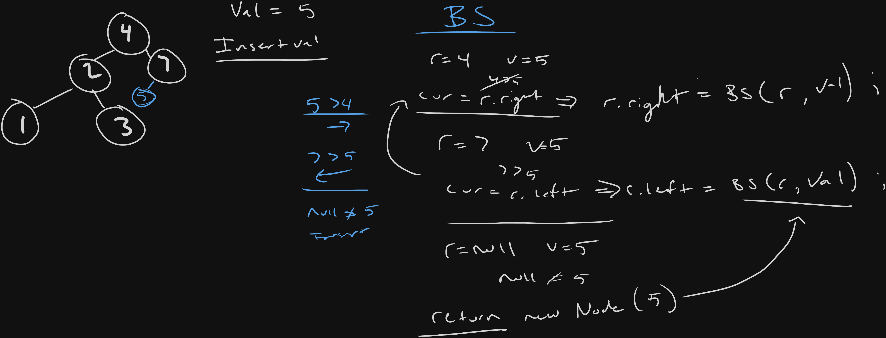

### Intuition


Compare val to current root traverse depending on greater or smaller value until we hit nullptr.

We then add node and return back up the stack.

### Approach

#### 1. We set left/right to keep changes dynamic.


    IF val is greater than root recurse right
    - R.right = insertIntoBST(root.right,val) 

    OR

    IF val is less than root recurse left
    -  R.left = insertIntoBST(root.left,val)

#### 2. we found a empty place to insert value


    IF we hit base case root == nullptr,
    - create node
    - return back up the stack

#### 3. return root


### Solution:

```cpp
/**
 * Definition for a binary tree node.
 * struct TreeNode {
 *     int val;
 *     TreeNode *left;
 *     TreeNode *right;
 *     TreeNode() : val(0), left(nullptr), right(nullptr) {}
 *     TreeNode(int x) : val(x), left(nullptr), right(nullptr) {}
 *     TreeNode(int x, TreeNode *left, TreeNode *right) : val(x), left(left), right(right) {}
 * };
 */
class Solution {
public:
    TreeNode* insertIntoBST(TreeNode* root, int val) {

        if(root == nullptr){
            return new TreeNode(val);
        }3

        if(root->val < val){
            root->right = insertIntoBST(root->right,val);
        }else{
            root->left = insertIntoBST(root->left,val);
        }
        
        return root;
    }
};
```


### Notes: 


